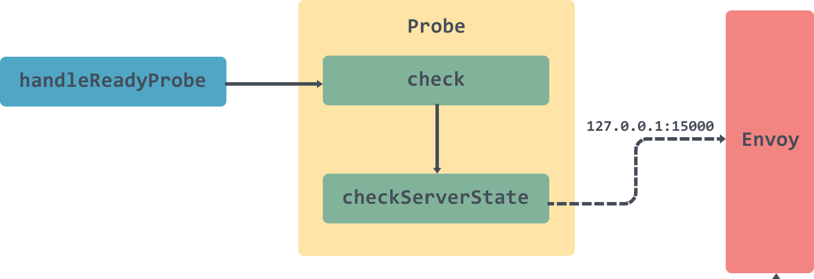
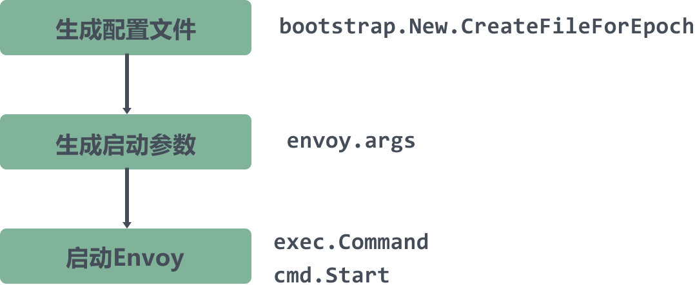

## 一、Istio Sidecar

#### Sidecar模式是什么

Sidecar模式是一种**单节点、多容器**的应用设计形式。Sidecar主张以额外的容器来扩展或增强主容器,而这个额外的容器被称为Sidecar容器

sidecar 模式也符合当前微服务的以下特点:

* 隔离(separation of concerns):让每个容器环境不需要相互依赖而独立运行,也就意味着sidecar程序可以和任何语言的应用服务一起运行。
* 单一责任原则(single responsibility principle),各个容器负责自己的处理逻辑,各司其职
* 内聚性/可重用性(Cohesiveness/Reusability)


在软件架构中， Sidecar 连接到父应用并且为其添加扩展或者增强功能。Sidecar 应用与主应用程序松散耦合。它可以屏蔽不同编程语言的差异，统一实现微服务的可观察性、监控、日志记录、配置、断路器等功能。

#### 使用 Sidecar 模式的优势

使用 sidecar 模式部署服务网格时，无需在节点上运行代理，但是集群中将运行多个相同的 sidecar 副本。在 sidecar 部署方式中，**每个应用的容器旁都会部署一个伴生容器（如 Envoy 或 MOSN），这个容器称之为 sidecar 容器**。Sidecar 接管进出应用容器的所有流量。**在 Kubernetes 的 Pod 中，在原有的应用容器旁边注入一个 Sidecar 容器，两个容器共享存储、网络等资源**，可以广义的将这个包含了 sidecar 容器的 Pod 理解为一台主机，两个容器共享主机资源。

因其独特的部署结构，使得 sidecar 模式具有以下优势：

* 将与应用业务逻辑无关的功能抽象到共同基础设施，降低了微服务代码的复杂度。
* 因为不再需要编写相同的第三方组件配置文件和代码，所以能够降低微服务架构中的代码重复度。
Sidecar 可独立升级，降低应用程序代码和底层平台的耦合度。

#### Sidecar模式

借助于K8S良好的可拓展性，使用sidecar模式可以享受到分布式系统中的规模化效率红利。相比于这种效率提升，我们可以容许性能上的开销。

### Sidecar实现

#### 该如何实现一个sidecar

* 在设计sidecar服务时,请慎重决定进程间通信机制。除非达不到性能要求,否则请尽量使用不区分语言或框架的技术。
* 在将功能放入sidecar之前,请考虑该功能是作为独立的服务还是更传统的守护程序运行更有利。
* 此外,请考虑是否能够以库的形式或使用传统扩展机制实现功能.特定于语言的库可能提供更深度的集成和更少的网络开销。

### A、Sidecar VM

1. 创建虚拟机
2. 设置环境变量
3. 安装依赖包
4. 上传脚本到虚拟机
5. 命令行启动多个可执行文件

### B、Sidecar docker

借助 docker-compose.yml 文件，开发人员可定义一组相关服务，通过部署命令将其部署为组合应用程序。 它还配置其依赖项关系和运行时配置。多个容器使用同一个network。

1. dockerfile -> image 
2. imges      -> docker-compose
3. docker-compose -> image


```yaml
version: '3.4'

services:

  webmvc:
    image: eshop/web
    environment:
      - CatalogUrl=http://catalog-api
      - OrderingUrl=http://ordering-api
    ports:
      - "80:80"
    depends_on:
      - catalog-api
      - ordering-api

  catalog-api:
    image: eshop/catalog-api
    environment:
      - ConnectionString=Server=sqldata;Port=1433;Database=CatalogDB;…
    ports:
      - "81:80"
    depends_on:
      - sqldata

  ordering-api:
    image: eshop/ordering-api
    environment:
      - ConnectionString=Server=sqldata;Database=OrderingDb;…
    ports:
      - "82:80"
    extra_hosts:
      - "CESARDLBOOKVHD:10.0.75.1"
    depends_on:
      - sqldata

  sqldata:
    image: mcr.microsoft.com/mssql/server:latest
    environment:
      - SA_PASSWORD=Pass@word
      - ACCEPT_EULA=Y
    ports:
      - "5433:1433"
```

#### istio dockerfile

```shell
# BASE_DISTRIBUTION is used to switch between the old base distribution and distroless base images
ARG BASE_DISTRIBUTION=debug

# Version is the base image version from the TLD Makefile
ARG BASE_VERSION=latest

# The following section is used as base image if BASE_DISTRIBUTION=debug
FROM gcr.io/istio-release/base:${BASE_VERSION} as debug

# The following section is used as base image if BASE_DISTRIBUTION=distroless
# This image is a custom built debian11 distroless image with multiarchitecture support.
# It is built on the base distroless image, with iptables binary and libraries added
# The source can be found at https://github.com/istio/distroless/tree/iptables
# This version is from commit 105e1319a176a5156205b9e351b4e2016363f00d.
FROM gcr.io/istio-release/iptables@sha256:bae9287d64be13179b7bc794ec3db26bd5c5fe3fb591c484992366314c9a7d3d as distroless

# This will build the final image based on either debug or distroless from above
# hadolint ignore=DL3006
FROM ${BASE_DISTRIBUTION:-debug}

WORKDIR /

ARG proxy_version
ARG istio_version
ARG SIDECAR=envoy

# Copy Envoy bootstrap templates used by pilot-agent
COPY envoy_bootstrap.json /var/lib/istio/envoy/envoy_bootstrap_tmpl.json
COPY gcp_envoy_bootstrap.json /var/lib/istio/envoy/gcp_envoy_bootstrap_tmpl.json

# Install Envoy.
ARG TARGETARCH
COPY ${TARGETARCH:-amd64}/${SIDECAR} /usr/local/bin/${SIDECAR}

# Environment variable indicating the exact proxy sha - for debugging or version-specific configs 
ENV ISTIO_META_ISTIO_PROXY_SHA $proxy_version
# Environment variable indicating the exact build, for debugging
ENV ISTIO_META_ISTIO_VERSION $istio_version

ARG TARGETARCH
COPY ${TARGETARCH:-amd64}/pilot-agent /usr/local/bin/pilot-agent

COPY stats-filter.wasm /etc/istio/extensions/stats-filter.wasm
COPY stats-filter.compiled.wasm /etc/istio/extensions/stats-filter.compiled.wasm
COPY metadata-exchange-filter.wasm /etc/istio/extensions/metadata-exchange-filter.wasm
COPY metadata-exchange-filter.compiled.wasm /etc/istio/extensions/metadata-exchange-filter.compiled.wasm

# The pilot-agent will bootstrap Envoy.
ENTRYPOINT ["/usr/local/bin/pilot-agent"]

```

### C、Sidecar k8s

#### 1、基于docker进行注入

Kompose是个转换工具，可将 compose（即 Docker Compose）所组装的所有内容 转换成容器编排器（Kubernetes 或 OpenShift）可识别的形式。

要将 docker-compose.yml 转换为 kubectl 可用的文件，请运行 kompose convert 命令进行转换，然后运行 kubectl create -f <output file> 进行创建。

#### 2、控制面进行注入 

#### 实现机制

K8S作为云原生操作系统的定位，其设计理念是"微内核"架构。

+ 单体进程，往往采用Filter机制。
+ 分布式系统，通过webhook机制将自定义插件注入到分布式集群中。
+ in-proxy模式，通过沙箱+远程脚本，实现非侵入性的单体进程内filter机制。

Kubernetes 的 apiserver 一开始就有 AdmissionController 的设计，这个设计和各类 Web 框架中的 Filter 很像，就是一个插件化的责任链，责任链中的每个插件针对 apiserver 收到的请求做一些操作或校验。分类

+ MutatingWebhookConfiguration，操作 api 对象的， 会对request的resource，进行转换，比如填充默认的request/limit（有副作用）
+ ValidatingWebhookConfiguration，校验 api 对象的, 比如校验Pod副本数必须大于2。（无副作用）

Kubernetes 中的许多高级功能需要启用准入控制器才能正确支持该功能。


#### K8S准入控制器

通过创建webhook资源，利用k8s的webhook能力实现pod的自动注入。

基于 Kubernetes 的 突变 webhook 入驻控制器（mutating webhook addmission controller 的自动 sidecar 注入方式。

实现流程大致如下：

1. 定义webhook监听pod
2. 注册到webhook

```yaml
apiVersion: admissionregistration.k8s.io/v1
kind: ValidatingWebhookConfiguration
metadata:
  name: "pod-policy.example.com"
webhooks:
- name: "pod-policy.example.com"
  rules:
  - apiGroups:   [""]
    apiVersions: ["v1"]
    operations:  ["CREATE"]
    resources:   ["pods"]
    scope:       "Namespaced"
  clientConfig:
    service:
      namespace: "example-namespace"
      name: "example-service"
    caBundle: "Ci0tLS0tQk...<base64-encoded PEM bundle containing the CA that signed the webhook's serving certificate>...tLS0K"
  admissionReviewVersions: ["v1", "v1beta1"]
  sideEffects: None
  timeoutSeconds: 5
```

#### 自动化和规模化

Kubernetes虽然提供了多种容器编排对象，例如Deployment、StatefulSet、DeamonSet、Job等，还有多种基础资源封装例如ConfigMap、Secret、Serivce等，但是一个应用往往有多个服务，有的可能还要依赖持久化存储，当这些服务之间直接互相依赖，需要有一定的组合的情况下，使用YAML文件的方式配置应用往往十分繁琐还容易出错，这时候就需要服务编排工具。


1. 编写k8s资源文件集合
2. 通过打包格式进行管理
3. 上传到镜像仓库
4. 通过k8s包管理工具helm进行安装

### D、Sidecar istio

#### sidecar injector 准入控制器

Istio 使用 ValidatingAdmissionWebhooks 验证 Istio 配置，使用 MutatingAdmissionWebhooks 自动将 Sidecar 代理注入至用户 Pod。

它使用 MutatingWebhook 机制在 pod 创建的时候将 sidecar 的容器和卷添加到每个 pod 的模版里。


```yaml
      containers:
      - image: docker.io/istio/examples-bookinfo-productpage-v1:1.15.0 # 应用镜像
        name: productpage
        ports:
        - containerPort: 9080
      - args:
        - proxy
        - sidecar
        - --domain
        - $(POD_NAMESPACE).svc.cluster.local
        - --configPath
        - /etc/istio/proxy
        - --binaryPath
        - /usr/local/bin/envoy
        - --serviceCluster
        - productpage.$(POD_NAMESPACE)
        - --drainDuration
        - 45s
        - --parentShutdownDuration
        - 1m0s
        - --discoveryAddress
        - istiod.istio-system.svc:15012
        - --zipkinAddress
        - zipkin.istio-system:9411
        - --proxyLogLevel=warning
        - --proxyComponentLogLevel=misc:error
        - --connectTimeout
        - 10s
        - --proxyAdminPort
        - "15000"
        - --concurrency
        - "2"
        - --controlPlaneAuthPolicy
        - NONE
        - --dnsRefreshRate
        - 300s
        - --statusPort
        - "15020"
        - --trust-domain=cluster.local
        - --controlPlaneBootstrap=false
        image: docker.io/istio/proxyv2:1.5.1 # sidecar proxy
        name: istio-proxy
        ports:
        - containerPort: 15090
          name: http-envoy-prom
          protocol: TCP
      initContainers:
      - command:
        - istio-iptables
        - -p
        - "15001"
        - -z
        - "15006"
        - -u
        - "1337"
        - -m
        - REDIRECT
        - -i
        - '*'
        - -x
        - ""
        - -b
        - '*'
        - -d
        - 15090,15020
        image: docker.io/istio/proxyv2:1.5.1 # init 容器
        name: istio-init
```

------

## 二、Istio polit-agent

+ Init 容器 istio-init：用于 pod 中设置 iptables 端口转发
+ Sidecar 容器 istio-proxy：运行 sidecar 代理，如 Envoy 或 MOSN。


#### init

Init 容器是一种专用容器，它在应用程序容器启动之前运行，用来包含一些应用镜像中不存在的实用工具或安装脚本。

一个 Pod 中可以指定多个 Init 容器，如果指定了多个，那么 Init 容器将会按顺序依次运行。只有当前面的 Init 容器必须运行成功后，才可以运行下一个 Init 容器。当所有的 Init 容器运行完成后，Kubernetes 才初始化 Pod 和运行应用容器。

Init 容器使用 Linux Namespace，所以相对应用程序容器来说具有不同的文件系统视图。因此，它们能够具有访问 Secret 的权限，而应用程序容器则不能。

在 Pod 启动过程中，Init 容器会按顺序在网络和数据卷初始化之后启动。每个容器必须在下一个容器启动之前成功退出。如果由于运行时或失败退出，将导致容器启动失败，它会根据 Pod 的 restartPolicy 指定的策略进行重试。然而，如果 Pod 的 restartPolicy 设置为 Always，Init 容器失败时会使用 RestartPolicy 策略。

在所有的 Init 容器没有成功之前，Pod 将不会变成 Ready 状态。Init 容器的端口将不会在 Service中进行聚集。 正在初始化中的 Pod 处于 Pending 状态，但应该会将 Initializing 状态设置为 true。Init 容器运行完成以后就会自动终止。

### A、istio sidecar 结构

### istio-init容器 

#### 1. istio-iptables 进程

```shell
istio-iptables [flags]
  -p: 指定重定向所有 TCP 流量的 sidecar 端口（默认为 $ENVOY_PORT = 15001）
  -m: 指定入站连接重定向到 sidecar 的模式，“REDIRECT” 或 “TPROXY”（默认为 $ISTIO_INBOUND_INTERCEPTION_MODE)
  -b: 逗号分隔的入站端口列表，其流量将重定向到 Envoy（可选）。使用通配符 “*” 表示重定向所有端口。为空时表示禁用所有入站重定向（默认为 $ISTIO_INBOUND_PORTS）
  -d: 指定要从重定向到 sidecar 中排除的入站端口列表（可选），以逗号格式分隔。使用通配符“*” 表示重定向所有入站流量（默认为 $ISTIO_LOCAL_EXCLUDE_PORTS）
  -o：逗号分隔的出站端口列表，不包括重定向到 Envoy 的端口。
  -i: 指定重定向到 sidecar 的 IP 地址范围（可选），以逗号分隔的 CIDR 格式列表。使用通配符 “*” 表示重定向所有出站流量。空列表将禁用所有出站重定向（默认为 $ISTIO_SERVICE_CIDR）
  -x: 指定将从重定向中排除的 IP 地址范围，以逗号分隔的 CIDR 格式列表。使用通配符 “*” 表示重定向所有出站流量（默认为 $ISTIO_SERVICE_EXCLUDE_CIDR）。
  -k：逗号分隔的虚拟接口列表，其入站流量（来自虚拟机的）将被视为出站流量。
  -g：指定不应用重定向的用户的 GID。(默认值与 -u param 相同)
  -u：指定不应用重定向的用户的 UID。通常情况下，这是代理容器的 UID（默认值是 1337，即 istio-proxy 的 UID）。
  -z: 所有进入 pod/VM 的 TCP 流量应被重定向到的端口（默认 $INBOUND_CAPTURE_PORT = 15006）。
```

### istio-proxy容器


使用单容器多进程模型。

为什么不使用单进程模型？代理属于第三方提供，istio是对其进行了管理和拓展。

如果代理本身属于istio，是可以实现单进程模型。

#### 1. pilot agent进程

在proxy镜像中，pilot-agent 负责的工作包括：

1. 生成envoy的配置：
   1. 与控制面板通讯，获取xDS配置
   2. 生成 Envoy 的Bootstrap启动配置
2. 启动envoy
3. 监控并管理envoy的运行状况
   1. envoy健康检查
   2. envoy出错时pilot-agent负责重启envoy
   3. envoy配置变更后reload envoy
   4. envoy优雅退出


#### status server

[/pilot-agent/main/initStatusServer]

#### envoy检查

对于 ready 检查，调用的路径为/healthz/ready， 并配合设置的端口 applicationPorts 通过 Envoy 的 admin 端口进行对应的端口进行检查，用于决定 Envoy 是否已经 ready 接受相对应的流量。

检查原理是通过本地管理端口，如 http://127.0.0.1:15000/listeners 获取 Envoy 当前监听的全部端口，然后将配置的端口 applicationPorts 在监听的端口中进行查找，来决定 Envoy 是否 ready。



#### 应用端口检查

检查的路径为 /url 路径，在 header 中设置 istio-app-probe-port 端口，使用 访问路径中的 url 来进行检查，最终调用的是 http://127.0.0.1:istio-app-probe-port/url，头部设置的全部参数也都会传递到别检测的服务端口上；

#### xds proxy

[/pilot-agent/main/istio_agent.NewAgent/initXdsProxy]

#### 2. proxy进程(第三方代理进程)

#### 启动Envoy

[/pilot-agent/main/istio_agent.NewAgent]



### B、流量拦截

#### iptables

```txt
ip netns exec cni-bf783dac-fe05-cb35-4d5a-848449119b19 iptables -L -t nat

-A PREROUTING -p tcp -j ISTIO_INBOUND                          # PREROUTING全部转发到INBOUND,PREROUTING发生在流入的数据包进入路由表之前
-A OUTPUT -p tcp -j ISTIO_OUTPUT                               # 由本机产生的数据向外转发的
-A ISTIO_INBOUND -p tcp -m tcp --dport 22 -j RETURN            # 22 15090  15021 15020的不转发到ISTIO_REDIRECT 
-A ISTIO_INBOUND -p tcp -m tcp --dport 15090 -j RETURN         
-A ISTIO_INBOUND -p tcp -m tcp --dport 15021 -j RETURN
-A ISTIO_INBOUND -p tcp -m tcp --dport 15020 -j RETURN
-A ISTIO_INBOUND -p tcp -j ISTIO_IN_REDIRECT                   # 剩余的流量都转发到ISTIO_REDIRECT
-A ISTIO_IN_REDIRECT -p tcp -j REDIRECT --to-ports 15006       # 转发到15006
-A ISTIO_OUTPUT -s 127.0.0.6/32 -o lo -j RETURN                # 127.0.0.6是InboundPassthroughBindIpv4,代表原地址是passthrough的流量都直接跳过,不劫持
-A ISTIO_OUTPUT ! -d 127.0.0.1/32 -o lo -m owner --uid-owner 1337 -j ISTIO_IN_REDIRECT  #lo网卡出流量,目标地址不是localhost的,且为同用户的流量进入ISTIO_IN_REDIRECT
-A ISTIO_OUTPUT -o lo -m owner ! --uid-owner 1337 -j RETURN    # lo网卡出流量 非同用户的不劫持
-A ISTIO_OUTPUT -m owner --uid-owner 1337 -j RETURN            # 剩下的同用户的都跳过
-A ISTIO_OUTPUT ! -d 127.0.0.1/32 -o lo -m owner --gid-owner 1337 -j ISTIO_IN_REDIRECT  # lo网卡出流量,目标地址非本地,同用户组的流量进入ISTIO_IN_REDIRECT
-A ISTIO_OUTPUT -o lo -m owner ! --gid-owner 1337 -j RETURN    # lo网卡出流量非同组的不劫持
-A ISTIO_OUTPUT -m owner --gid-owner 1337 -j RETURN            # 剩余的同用户的不劫持
-A ISTIO_OUTPUT -d 127.0.0.1/32 -j RETURN                      # 剩余的目标地址为127的不劫持
-A ISTIO_OUTPUT -j ISTIO_REDIRECT                              # 剩下的都进入 ISTIO_REDIRECT
-A ISTIO_REDIRECT -p tcp -j REDIRECT --to-ports 15001          # 转达到15001 outbond
COMMIT
```


------

## 三、Sidecar 发展

### A、sidecar 流量交互

要实现 应用容器(进程) 和 Sidecar容器(进程) 之间的交互。需要完成流量交互的功能。

### 流量交互模式

对于跨容器(进程)的流量交互，主要有以下两种交互模式：

> proxyless sidecar 和 Servicemesh 在方式上的差异：暴露 API 还是代理通讯协议。

#### 1. 流量劫持 servicemesh

> 在 Servicemesh 中，“零侵入”是一个非常强调的特性，为此不惜引入 iptables 等流量劫持方案。“零侵入”在某些特殊场景下会发挥巨大的优势，如旧有应用不做改造的前提下接入 servicemesh。好处自然不言而喻，但零侵入也有自身的限制：客户端必须能发出符合服务器端要求的网络通讯请求，这个过程外部无法插手。

代理模式强调的是 原协议转发，应用进程无感。往往使用操作系统提供的流量劫持功能。

适合于统一的网络协议栈（HTTP），仅实现原协议层面的控制（路由、重试等）。

应用场景：envoy流量代理

发展方向：内核高性能（eBPF）

#### eBPF


几乎没有开销是来自代理本身的逻辑。开销是通过注入代理，将网络流量重定向到它，终止连接和启动新的连接而增加的。


#### 2. 流量明确指向 proxyless sidecar

应用进程明确转发，协议自由切换，更丰富的应用层语义。往往使用grpc建立跨进程的链接。

适合异构协议栈，支持更丰富的功能，支持协议之上应用层语义的控制。

应用场景：multi runtime

发展方向：grpc proxyless sidecar

#### proxyless sidecar

gRPC 项目对 xDS API 有很好的支持，也就是说你可以管理 gRPC 工作负载，而不需要同时部署 Envoy sidecar。


### B、multi sidecar

ServiceMesh 在微服务领域已经非常流行，越来越多的公司开始在内部落地，ServiceMesh 带来的业务解耦，平滑升级等优势大大提高了中间件的迭代效率。

不过 ServiceMesh 只解决了服务间通讯的需求，而现实中的分布式应用存在更多的需求。而效仿 ServiceMesh 将应用需要的其他分布式能力外移到各种 Sidecar Runtime，这逐渐演变成了一个趋势。


与其依靠多个代理来实现不同的目的（例如网络代理，缓存代理，绑定代理），不如使用一个 Mecha 提供所有这些能力。

Mecha 强调是“提供能力”，而不是通讯代理。

Mecha 和 Micrologic 之间的交互是开放而有 API 标准的，Mecha 和 Micrologic 之间的“协议”体现在 API 上，而不是 TCP 通讯协议。这提供了一个契机：一个统一 Micrologic 和 Mecha 之间通讯方式的契机。


### C、sidecar 拓展性

面对千变万化的需求和复杂的应用环境，期望 Sidecar 本身的控制面和数据面来覆盖所有的场景显然是不现实的。强大、全面往往是因为**易扩展**。

#### 1. 控制面拓展

使用类似K8S webhook的机制，将自定义插件注入到控制面中，作为单独的服务执行。

此类扩展可以完全无侵入的实现数据平面的增强。而且 API 的抽象屏蔽了数据平面的实现细节，扩展会具有更好的可移植性；独立进程执行和部署，具备更强的伸缩性。但是 webhook 模 也引入了大量额外的外部调用和数据交互，带来了巨大的性能开销。


#### 2. in-proxy拓展（WASM）


> WebAssembly，简称 WASM，是一个二进制指令集，最初是跑在浏览器上来解决 JavaScript 的性能问题，但由于它良好的安全性，隔离性以及语言无关性等优秀特性，很快人们便开始让它跑在浏览器之外的地方，随着 WASI 定义的出现，只需要一个 WASM 运行时，就可以让 WASM 文件随处执行。

#### WASM和Java字节码非常相似

WASM 字节码不能直接在任何 CPU 架构上执行，但由于它与机器码非常相近，因此能够以非常快的速度被 WASM 引擎（或者也可以称之为 WASM 虚拟机）翻译为对应架构的机器码，获得和机器码相近的性能。

WASM 本身是为 Web 而设计，因此天然具有跨平台支持；同时，通过 WASM 虚拟机的沙箱隔离，也使得执行 WASM 字节码相比于直接执行机器码有更高的安全性。

#### Envoy Wasm

Envoy 在可拓展性方面做了两方面的工作：

第一，提供了名为 lua 的特殊扩展，允许控制面通过 xDS 协议动态下发 Lua 脚本并由 Envoy 解释执行。 

第二，也是本节的主题，Envoy 引入了 WASM 技术用于开发 Envoy 扩展。


#### Istio Wasm

Istio 的扩展机制使用 Proxy-Wasm 应用二进制接口（ABI）规范，提供了一套代理无关的流媒体 API 和实用功能，可以用任何有合适 SDK 的语言来实现。

扩展 Istio 的功能，满足你的特定需求，需要三个步骤：

1. 在 Golang 中实现你的插件功能。
2. 编译、构建，并将 Wasm 模块推送到符合 OCI 标准的 Docker 镜像仓库。
3. 使用 WasmPlugin 资源配置服务网格工作负载，以便从远程镜像仓库中拉取 Wasm 模块。

### E、其他

#### 1. 服务发现

Mesh: dns拦截


